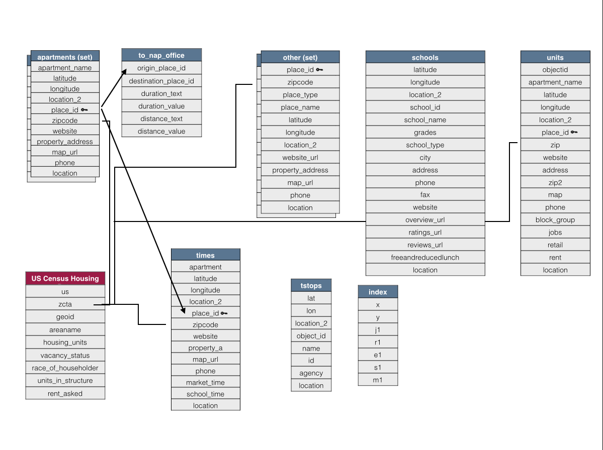
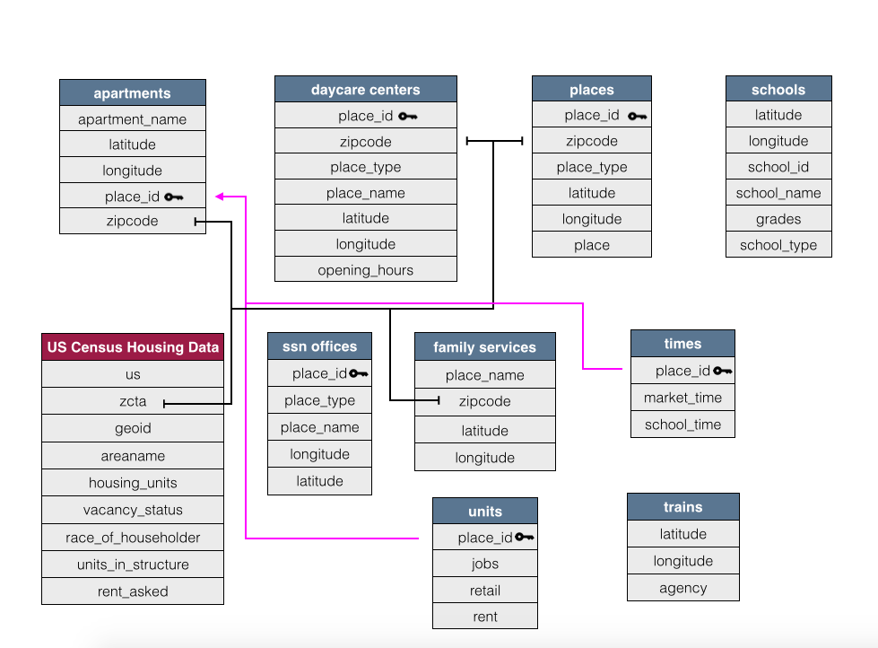

```{r setup, include=TRUE}
knitr::opts_chunk$set(echo = TRUE)
require(data.world)
require(MASS)
require(ISLR)
require(dplyr)
require(ggplot2)
require(gridExtra)
require(reshape2)
```
#<a name="model"></a>**Data Model**






#<a name="clean"></a>**Data Cleaning** 
We initially had 20 tables to clean - so for simplicity's sake we will just show an example of how we cleaned a few of these twenty. 

```{r, eval = FALSE}
daycare	=	read_csv("/Users/amandale/Downloads/stcyngyn-fall-2017-edvproject-5/day_care_centers.csv", col_types = cols(
  place_id = col_character(),
  zipcode = col_integer(),
  place_type = col_character(),
  place_name = col_character(),
  latitude = col_double(),
  longitude = col_double(),
  website_url = col_character(),
  property_address = col_character(),
  map_url = col_character(),
  phone = col_character(),
  opening_hours = col_character()
))

daycare = daycare %>% dplyr::select(place_id, zipcode, place_type, place_name, latitude, longitude, opening_hours)

for(n in names(daycare)){
  daycare[n] <- data.frame(lapply(daycare[n], gsub, pattern="[^ -~]",replacement = ""))
}

write_csv(daycare, "/Users/amandale/Downloads/DataCleaning/daycarecenters.csv")

```

We also have a slew of tables that should be combined into one. This also involved changing the column names as well as creating a new column. The code we used to do this is below: 
```{r, eval=FALSE}
driver_serv = dplyr::mutate(driver_serv, place = "driver service")
esl = dplyr::mutate(esl, place = "esl")
grocery = dplyr::mutate(grocery, place = "grocery store")
markets = dplyr::mutate(markets, place = "market")

names(markets)[3] = "place_type"
names(markets)[4] = "place_name"

pcp = dplyr::mutate(pcp, place = "primary care location")
supermarkets = dplyr::mutate(supermarkets, place = "supermarket")
worship = dplyr::mutate(worship, place = "place of worship")
places = rbind(driver_serv, esl)
places = rbind(places, grocery)
places = rbind(places, markets)
places = rbind(places, pcp)
places = rbind(places, supermarkets)
places = rbind(places, worship)
```


#<a name="sql"></a>**SQL Queries**

Import the data from data.world, where the bulk of the work is done on the back end.


```{r, message = FALSE}
project <- "https://data.world/rc38246/f-17-edv-project-5"
data.world::set_config(cfg_env("DW_API"))
schools <- data.world::query(
  data.world::qry_sql("SELECT s.latitude AS slat, s.longitude AS slong, school_name, a.latitude AS alat, a.longitude AS along, apartment_name FROM schools AS s cross join apartments AS a WHERE s.grades = 'Elementary' and school_type = 'public'"),
  dataset = project
  )

places2 <- data.world::query(
  data.world::qry_sql("SELECT places.place_id, places.zipcode, places.place_type, places.place_name, places.latitude, places.longitude, places.place
FROM places"),
  dataset = project
)

zcta <- data.world::query(
  data.world::qry_sql("SELECT usa_zcta.zcta , usa_zcta.b25001_001 as housing_units , usa_zcta.b25058_001 as median_rent, usa_zcta.b25071_001 as rent_percentage_of_income,
usa_zcta.b25003a_001/usa_zcta.b25003_001 as white_homeowners,
usa_zcta.b25003b_001/usa_zcta.b25003_001 as black_homeowners,
usa_zcta.b25003c_001/usa_zcta.b25003_001 as native_homeowners,
usa_zcta.b25003d_001/usa_zcta.b25003_001 as asian_homeowners,
usa_zcta.b25003e_001/usa_zcta.b25003_001 as pacific_islander_homeowners,
usa_zcta.b25003f_001/usa_zcta.b25003_001 as other_homeowners FROM usa_zcta"),
  dataset = project
)

zipcodes = c(30004,30005, 30009, 30012, 30013, 30017, 30021, 30023, 30024, 30028, 30030,30031,
             30032, 30033, 30034, 30035, 30038, 30039, 30040, 30043, 30047, 30052, 30058,
             30062, 30066, 30072, 30074, 30075, 30076, 30077, 30078, 30079)
zcta = zcta %>% dplyr::filter(is.element(zcta, zipcodes))

apartments <- data.world::query(
  data.world::qry_sql("SELECT apartments.apartment_name, apartments.latitude, apartments.longitude, apartments.place_id, apartments.zipcode
FROM apartments"),
  dataset = project
)

daycare <- data.world::query(
  data.world::qry_sql("SELECT daycarecenters.place_id, daycarecenters.zipcode, daycarecenters.place_type, daycarecenters.place_name,
daycarecenters.latitude, daycarecenters.longitude, daycarecenters.location, daycarecenters.opening_hours
FROM daycarecenters"),
  dataset = project
)

times <- data.world::query(
  data.world::qry_sql("SELECT zipcode, white_homeowners, market_time as mtime, school_time as stime FROM apartments JOIN times using(place_id) JOIN (SELECT usa_zcta.zcta,
usa_zcta.b25003a_001/usa_zcta.b25003_001 as white_homeowners
FROM usa_zcta) as temp on temp.zcta = apartments.zipcode"),
  dataset = project
  )

units <- data.world::query(
  data.world::qry_sql("SELECT * from units"),
  dataset = project
)

places <- data.world::query(
  data.world::qry_sql("SELECT * from places"),
  dataset = project
)
schools2 <- data.world::query(
  data.world::qry_sql("SELECT * from schools"),
  dataset = project
)

housing <-- data.world::query(
  data.world::qry_sql("SELECT usa_zcta.zcta , usa_zcta.b25001_001 as housing_units , usa_zcta.b25058_001 as median_rent, usa_zcta.b25071_001 as rent_percentage_of_income
FROM usa_zcta"),
data = project
)
attach(places)
attach(schools)
attach(times)
```

#<a name="resources"></a>**Resources**
## Types of Resources
This cross-tab lists the types of resources within each zipcodes. There is no doubt that coming into a foreign place with little understanding of a culture is difficult, and the zipcodes that are most rich in resources can mean that refugees have just a slightly easier time getting settled, especially when it comes to local government offices to register their identities, grocery stores for sustenance, and places of worship, where they may find people coming from similar circumstances, and build connections, and communities of people who support each other while adjusting.


```{r echo = TRUE}
```
<iframe align = "center" width = "800" height = "800" src="https://public.tableau.com/profile/stacy.nguyen#!/vizhome/crosstab_13/Sheet1?publish=yes"/>

#<a name="schools"></a>**Schools**
## Types of Schools{.tabset .tabset-fade}
It would have been interesting to see what the enrollment is for refugee students in either charter or public schools to compare, but that data is not made available. Because this is a refugee relocation data set, it might be safe to assume that the schools in the data have refugee students enrolled, so we will assume more public schools have refugee students than charter school. 


### Charter Schools

The fact that charter schools are even in the data may be a hopeful sign that some refugee parents are fortunate enough to send their children to charter schools.


### Public Schools


---
We do not have any data for private schools in this table; considering refugee's circumstances, they may lack resources to pay tuition for private schools.

 

#<a name="apts"></a>**Schools and Apartments**
## How many schools are in range of how many apartments?
Adjusting the slider below changes the range. If we set the slider to it's minimum value, we see that all apartments in the data set are within 1 km from a public elementary school. This means that the local municipalities did a good job of ensuring public education for their constituents.

Increasing the range causes the data to take a Boltzmann-like distribution, which means that the majority of apartments are near only a handful of schools, and the number of outliers decrease as you progress rightward on the graph. 

```{r}
R = 6371
deg2rad <- function(deg) {(deg * pi) / (180)}
# Determines the curvilinear distance between two coordinates in km
distances <- schools %>% dplyr::mutate(dLat = deg2rad(slat-alat), dLon = deg2rad(slong-along), a = sin(dLat/2)*sin(dLat/2)+cos(deg2rad(slat))*cos(deg2rad(alat))*sin(dLon/2)*sin(dLon/2), c = 2*atan2(sqrt(a), sqrt(1-a)), dist = R*c) %>% dplyr::select(school_name,apartment_name,dist)

sliderInput("range", "Range (in km):", min = 1, max = 10, value = 5)

renderPlot({
  distances %>% dplyr::filter(dist <= input$range) %>% dplyr::group_by(apartment_name) %>% dplyr::summarise(num_schools = n()) %>% ggplot(aes(num_schools)) + geom_bar() + labs(x = "Number of Schools", y = "Number of Apartments")
})
```

<!-- #<a name="units"></a>**Units** -->
<!-- ##Housing Units vs Median Rent -->
<!-- The less rent costs, the bigger the percentage it takes from a family's, or one refugee's income, which Amanda has mentioned in a previous insight was odd. I wanted to attempt to put two of her visualizations into one, and this combined visualization agrees with her statement that when there is plenty of housing, the percentage it takes from income also decreases.  -->
```{r, warning = FALSE}
# r <- ggplot(housing, aes(x=rent_percentage_of_income))
# r <- r + geom_line(aes(y = housing_units, colour = "Rent Percentage of Income"))
#   
#   r <- r + geom_point(aes(y = housing_units, colour = "Housing Units"))
#   #r <- r + ylim(limits = c(0,30))
#   # now adding the secondary axis, following the example in the help file ?scale_y_continuous
#   # and, very important, reverting the above transformation
#   r <- r + scale_y_continuous(sec.axis = sec_axis(~.*5, name = "Median Rent"))
#   #r <- r + scale_y_continuous(limits = c(0,1000))
#   r <- r + scale_colour_manual(values = c("pink", "purple"))
#   r <- r + labs(y = "Housing Units",
#                 x = "Rent Percentage of Income",
#                 colour = "Parameter")
#   r <- r + theme(legend.position = c(0.8, 0.9))
# r
```


```{r}


#Place_types <- eventReactive(c(input$selectPlace_type), {
#  library('stringr')
 # str_c(input$selectPlace_type, collapse=', ')
#})

#df1 <- eventReactive(c(input$selectPlace_type), {
  #project <- "https://data.world/rc38246/f-17-edv-project-5"
  #data.world::set_config(cfg_env("DW_API"))
  #paramQuery <- data.world::qry_sql(
  # "SELECT * from places,
    #group by zipcode, place type
   #")
  #paramQuery$params <- c(input$selectPlaceType)
 # data.world::query(paramQuery, dataset = project)
#})

#renderDataTable({
  #DT::datatable(df1(), rownames = FALSE,
  #extensions = list(Responsive = TRUE, FixedHeader = TRUE)
 # )
#})


#placetypeb <- eventReactive(c(input$selectPlacetype2)
#, {(

#project <- "https://data.world/rc38246/f-17-edv-project-5",
 # data.world::set_config(cfg_env("DW_API")) 
  #paramQuery <- data.world::qry_sql(
   #"SELECT * from places LIMIT 5000")
  
 #paramQuery$params <- c(input$selectPlacetype2)
 #data.world::query(paramQuery, dataset = project)
#})

#renderPlot({placetypeb() %>% dplyr::filter(place_type == #input$selectPlacetype2) %>% dplyr::mutate(zipcode = #ifelse(Percent2012IAHome < 62, 'Low', ifelse(Percent2012IAHome >= #72, 'High', 'Medium'))) %>% ggplot() + 
 # geom_text(aes(x=zipcode, y=place_type, label=Percent2012IAHome), #size=6) +
 # geom_tile(aes(x=zipcode, y=place_type, fill=zipcode), alpha=0.50) #+
    #theme(legend.text=element_text(size=20)) +
    #theme(axis.text=element_text(size=20),
    #axis.title=element_text(size=20, face="bold"))  + 
   # theme(plot.title = element_text(size = 30, face = "bold")) +
  #  ggtitle(paste("Place Type According to Zipcodes")) +
 # xlab("Zipcode") + ylab("Place Type")
#}, height = 500, width = 1200)
```
#<a name="race"></a>**Homeowner Demographics**
The chart below tracks the time it takes to get from an apartment to the nearest market and school graphed against the percentage of the population that is white. Since Atlanta is in the South, historical racial segregation would lead to the assumption that conditions would worsen as communities become less white. This would theoretically manifest itself as longer travel times to get to school and the market. The chart below, however, tells a very different story.
```{r}
times <- times %>% dplyr::filter(is.element(zipcode, zipcodes)) %>% dplyr::mutate(market_time = dplyr::if_else(grepl("hour",mtime), 60*as.numeric(unlist(strsplit(mtime," "))[1])+as.numeric(unlist(strsplit(mtime," "))[3]),as.numeric(unlist(strsplit(mtime," "))[1])), school_time = dplyr::if_else(grepl("hour",stime), 60*as.numeric(unlist(strsplit(stime," "))[1])+as.numeric(unlist(strsplit(stime," "))[3]),as.numeric(unlist(strsplit(stime," "))[1]))) %>% dplyr::select(-mtime,-stime,-zipcode)

renderPlot({
  times %>% dplyr::filter(market_time<150,school_time<150)%>% tidyr::gather(variable, value, -white_homeowners) %>% dplyr::mutate(label = dplyr::if_else(variable == "market_time", "Home to Market", "Home to School")) %>%  ggplot(aes(x = white_homeowners, y = value, color = label)) + geom_point() + labs(x = "Proportion of White Homeowners", y = "Travel Times (min)")
})
```
It would appear that the proportion of homeowners who are white has no effect on the travel time to schools nor the travel time to markets. Furthermore, the travel time to school seems uniform across the board. While the data alone gives no indication for cause, it is possible that this uniform travel time to school is the result of the Supreme Court's decision in Brown v. Board of Education, which forced the integration of de jure segregated schools in the South.

It also appears that the travel time to markets is polarized amongst two different extremes. In one case, the travel time is in the single digits; in the other, it's well over an hour. Unfortunately, the data alone is not sufficient to determine the cause.

#<a name="rfg"></a>**Ideal Housing**
First I created a series of boxplots to visualize multiple variables on our "ideal zipcode" subset discovered [here](https://data.world/rc38246/f-17-edv-project-5/insights?anchor=https%3A%2F%2Fmedia.data.world%2FyLLFqp4RQGq5XUjes1Op_image.png&id=df0e03e7-38da-4bf1-9deb-ed10e35771d9&source=sb).
```{r, warning = FALSE}

plot1 = ggplot(data = zcta, mapping = aes(x=zcta, y=median_rent)) + geom_boxplot() + ggtitle("Rent Dist")

plot2 = ggplot(data = zcta, mapping = aes(x=zcta, y=rent_percentage_of_income)) + geom_boxplot() + ggtitle("Rent %")

plot3 = ggplot(data = zcta, mapping = aes(x=zcta, y=housing_units)) + geom_boxplot() + ggtitle("Units")

zcta2 = zcta %>% dplyr::mutate(accessible_housing = housing_units/median_rent)

plot4 = ggplot(data = zcta2, mapping = aes(x=zcta, y=accessible_housing)) + geom_boxplot() + ggtitle("Acc. Housing")

grid.arrange(plot1, plot2, plot3, plot4, ncol=4) 

```
The most important to notice is the "accessible housing" score. This is a calculated field, where "accessible housing" = "housing units" / "median rent". We will use this later in evalutating ideal zipcodes for refugees to reside in. Ideally, we would like an "accessible housing" score of at least 15. 

Next we look at how many units are available per zipcode: 
```{r}
ggplot(data = zcta, mapping = aes(x=zcta, y=housing_units)) + geom_bar(stat="identity") + ggtitle("Housing Units Available by Zip") + scale_x_discrete()
```

At first glance, as the rent percentage increases, median rent decreases. Does this intuitively make sense?
```{r}
ggplot(data = zcta, mapping = aes(x=rent_percentage_of_income, y=median_rent)) + geom_point() + geom_smooth(method = lm, fullrange= TRUE, se=FALSE, color = "black" ) + ggtitle("Rent Analytics ") 
```

Answer: Not really. We then created a parameter called "housing_fence", as we are primarily interested in zipcodes with plenty of housing. In this example, our "housing_fence" is 5000. 
```{r}
zcta3 = zcta %>% dplyr::mutate(housing_plentiful = ifelse(housing_units < 5000, "false", "true"))
ggplot(data = zcta3, mapping = aes(x=rent_percentage_of_income, y=median_rent, color = housing_plentiful)) + geom_point() + geom_smooth(method = lm, fullrange= TRUE, se=FALSE ) + ggtitle("Rent Analytics 2")
```
We can see that rent goes down when there is plenty of housing - which makes a lot more sense.

Experiment below with changing the "housing fence," and how it affects trend lines in segregated groups. 

```{r}
housing_min = min(zcta$housing_units)
housing_max = max(zcta$housing_units)


sliderInput("varFence", "Housing Fence:", min = housing_min, max = housing_max, value = 5)

renderPlot({
  zcta %>% dplyr::mutate(housing_plentiful = ifelse(housing_units < input$varFence, "false", "true")) %>% ggplot( mapping = aes(x=rent_percentage_of_income, y=median_rent, color = housing_plentiful)) + geom_point() + geom_smooth(method = lm, fullrange= TRUE, se=FALSE ) + ggtitle("Rent Analytics 3")
})
```

We then take the top 10 zipcodes of this subset by the availability of housing units. I wanted to look at the racial makeup of these areas - the reasoning being that greater diversity results in an easier acclimation into the community for refugees. 
```{r}
zcta4 = zcta %>% dplyr::arrange(desc(housing_units)) %>% dplyr::top_n(10, housing_units) %>% dplyr::mutate(minority_perc = 1 - white_homeowners)
ggplot(data = zcta4, mapping = aes(x=zcta, y=minority_perc)) + geom_bar(stat="identity")+ggtitle("% of Minority Homeowners by Zipcode") + scale_x_discrete()
```

When we take zipcodes with greater than 25% minorities, we get the following zipcodes:
```{r}
zcta5 = zcta4 %>% dplyr::filter(minority_perc > .25)
zcta5$zcta
```

Lastly, we will look at the variety of places available in these four zipcodes: 
```{r, warning = FALSE}
places3 = places2 %>% dplyr::filter(is.element(zipcode, zcta5$zcta)) %>% select(zipcode, place_type) %>% dplyr::group_by(zipcode, place_type) %>% summarise(num_place= n())

places4 = dcast(data = places3, formula(zipcode~place_type, value.var = num_place, fun.aggregate = sum))
places4 = melt(data=places4, id.vars='zipcode')
ggplot(data = places4, aes( x = factor( zipcode ), y = value, fill = variable ) ) + geom_bar( stat = 'identity' ) + ggtitle("Variety of Resources by Zip")
```

You can also look at the boxplot for each of these zipcodes: 
```{r}
inputPanel(
  selectInput("varZip", label = "Select ZipCode:",
              choices = places3$zipcode, selected = '30024', multiple=FALSE)
)

renderPlot({
  dataFilter = places3 %>% dplyr::filter(zipcode == input$varZip)
  ggplot(data=dataFilter, mapping=aes(x=zipcode, y=num_place)) + geom_boxplot() + scale_x_discrete() + ggtitle("Spread of Resources by Zip")

})
```

Through the bargraph and boxplots, it's easy to see zipcode '30024' is the most promising to house refugees.

As confirmation - there are resources for many immigrants that can be found on the internet in the '30024' zipcode. Example [here](http://www.aarc-atlanta.org/).

#**Appendix**  
***Tableau Concepts***  
boxplot [1](https://data.world/rc38246/f-17-edv-project-5/insights?anchor=https%3A%2F%2Fmedia.data.world%2FiQQPondtTkKFjE2WWTRh_image.png&id=e362784c-4162-4d00-a1e1-f9111dc0d35d&source=sb)   
histogram [1](https://data.world/rc38246/f-17-edv-project-5/insights?anchor=https%3A%2F%2Fmedia.data.world%2FyylcBAOsQYqHIum7NIjs_image.png&id=46205490-5cd9-4785-80a3-2484fbbe910f&source=sb) [2](https://data.world/rc38246/f-17-edv-project-5/insights?anchor=https%3A%2F%2Fmedia.data.world%2FdpOkzLT9qREjEJ41Lcvw_Worship1.png&id=47640be2-b17b-4ebd-9a75-d968fec84196&source=sb) [3](https://data.world/rc38246/f-17-edv-project-5/insights?anchor=https%3A%2F%2Fmedia.data.world%2FcLfg5bC4QoiKozJxJD4Q_school1.png&id=0d7038d0-0916-44ef-828d-4e42e00b6982&source=sb) [4](https://data.world/rc38246/f-17-edv-project-5/insights?anchor=https%3A%2F%2Fmedia.data.world%2FofCFxvrTQOKZftCJypZQ_image.png&id=d28e82a5-c90b-4aa8-8b7b-846e762978ea&source=sb)  
packed bubbles [1](https://data.world/rc38246/f-17-edv-project-5/insights?anchor=https%3A%2F%2Fmedia.data.world%2F9BkDqC9FT7qoGyBHpMnu_Daycare%2520Center.png&id=e07d5374-fbd9-43b0-8b49-6a797be72f1f&source=sb)  
treemap [1](https://data.world/rc38246/f-17-edv-project-5/insights?anchor=https%3A%2F%2Fmedia.data.world%2F4Q7Pc8YT4yTuUy3wIRrB_image.png&id=33a98ef9-a3ed-4d7b-822f-97d66aa82bef&source=sb)  
scatterplot [1](https://data.world/rc38246/f-17-edv-project-5/insights?anchor=https%3A%2F%2Fmedia.data.world%2FUETCkNnRcedvmbVpaYD4_medianvhousing.png&id=c4a739e8-2601-4dc6-9936-b8781f901e62&source=sb) [2](https://data.world/rc38246/f-17-edv-project-5/insights?anchor=https%3A%2F%2Fmedia.data.world%2FyX179ukTSdCaVTDkHP47_image.png&id=8cb47d40-ba0c-4fa1-b57b-9db57145f93f&source=sb)  
maps/actions [1](https://data.world/rc38246/f-17-edv-project-5/insights?anchor=https%3A%2F%2Fmedia.data.world%2FioiPLtxGTCKEtL6DaOjS_image.png&id=014552b8-a4ad-4be2-ab3e-84fca506b7b5&source=sb)  
dashboard [1](https://data.world/rc38246/f-17-edv-project-5/insights/46205490-5cd9-4785-80a3-2484fbbe910f)  
trend model [1](https://data.world/rc38246/f-17-edv-project-5/insights?anchor=https%3A%2F%2Fmedia.data.world%2Fbvr8mJoTmCMsCyqzHJ2t_image.png&id=8cb47d40-ba0c-4fa1-b57b-9db57145f93f&source=sb)  
barchart [1](https://data.world/rc38246/f-17-edv-project-5/insights?anchor=https%3A%2F%2Fmedia.data.world%2FM2CZgoiSRVCMhE3SkKJv_image.png&id=ab42f491-a0a3-4170-b210-4bad400fad06&source=sb) [2](https://data.world/rc38246/f-17-edv-project-5/insights?anchor=https%3A%2F%2Fmedia.data.world%2FyX179ukTSdCaVTDkHP47_image.png&id=8cb47d40-ba0c-4fa1-b57b-9db57145f93f&source=sb)  
ID set [1](https://data.world/rc38246/f-17-edv-project-5/insights?anchor=https%3A%2F%2Fmedia.data.world%2FM2CZgoiSRVCMhE3SkKJv_image.png&id=ab42f491-a0a3-4170-b210-4bad400fad06&source=sb)  
crosstab [1](https://data.world/rc38246/f-17-edv-project-5/insights?anchor=https%3A%2F%2Fmedia.data.world%2FRgsajxEUSo6W4Fbszz0H_crosstab2.png&id=6379e9bc-e0c8-45d2-ba5c-6351b1424f1f&source=sb)   
calculated fields [1](https://data.world/rc38246/f-17-edv-project-5/insights?anchor=https%3A%2F%2Fmedia.data.world%2FyX179ukTSdCaVTDkHP47_image.png&id=8cb47d40-ba0c-4fa1-b57b-9db57145f93f&source=sb) [2](https://data.world/rc38246/f-17-edv-project-5/insights?anchor=https%3A%2F%2Fmedia.data.world%2FiQQPondtTkKFjE2WWTRh_image.png&id=e362784c-4162-4d00-a1e1-f9111dc0d35d&source=sb)  
set [1](https://data.world/rc38246/f-17-edv-project-5/insights?anchor=https%3A%2F%2Fmedia.data.world%2FiQQPondtTkKFjE2WWTRh_image.png&id=e362784c-4162-4d00-a1e1-f9111dc0d35d&source=sb) [2](https://data.world/rc38246/f-17-edv-project-5/insights?anchor=https%3A%2F%2Fmedia.data.world%2FyLLFqp4RQGq5XUjes1Op_image.png&id=df0e03e7-38da-4bf1-9deb-ed10e35771d9&source=sb)
parameter [1](https://data.world/rc38246/f-17-edv-project-5/insights?anchor=https%3A%2F%2Fmedia.data.world%2FyX179ukTSdCaVTDkHP47_image.png&id=8cb47d40-ba0c-4fa1-b57b-9db57145f93f&source=sb)   
dual axis [1](https://data.world/rc38246/f-17-edv-project-5/insights?anchor=https%3A%2F%2Fmedia.data.world%2FTpS2000vRCSU6Fr9tfaT_image.png&id=a9dc7bba-08a5-47fc-a3c1-1a5c4f3e5a85&source=sb)  
pages [1](https://data.world/rc38246/f-17-edv-project-5/insights?anchor=https%3A%2F%2Fmedia.data.world%2FyLLFqp4RQGq5XUjes1Op_image.png&id=df0e03e7-38da-4bf1-9deb-ed10e35771d9&source=sb) [2](https://data.world/rc38246/f-17-edv-project-5/insights/0d7038d0-0916-44ef-828d-4e42e00b6982)  

***ggplot Concepts***  
boxplot [1](#rfg)  
histogram  
scatterplot [1](#rfg)  
maps  
trend model [1](#rfg)  
barchart  [1](#rfg)  
ID set  
calculated fields [1](#rfg)  
set [1](#clean)  
parameter [1](#rfg)  
dual axis  

***SQL***  
select [1](#sql)  
where [1](#sql)  
joins [1](#sql)  

***dplyr methods***  
select [1](#clean) [2](#apts)  
mutate [1](#clean) [2](#apts) [3](#rfg)   
filter [1](#sql) [2](#apts)  
group by [1](#apts)  
summarise [1](#apts) [2](#rfg)  
arrange [1](#rfg)  
top_n [1](#rfg)  

***other***  
data model [1](#model)  
read_csv [1](#clean)    
write_csv [1](#clean)    
regular expressions [1](#clean)  
grep [1](#race)
tidyr::gather [1](#race)  
interactive visualizations [1](#apts) [2](#rfg)  

